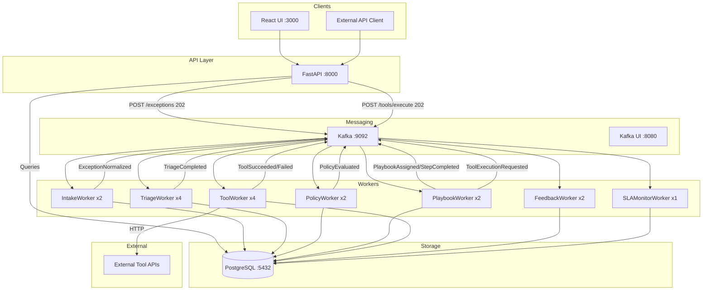

# State of the Platform

> Authoritative snapshot of what exists in SentinAI today.

**Last updated:** Phase 12+ Governance & Audit Polish complete

---

## 1. What Is Implemented Today

### Core Pipeline (Async, Event-Driven)

| Capability | Status | Notes |
|------------|--------|-------|
| **Intake** | Complete | Normalizes raw exceptions via IntakeWorker |
| **Triage** | Complete | Classifies severity/type via TriageWorker |
| **Policy** | Complete | Evaluates tenant policies via PolicyWorker |
| **Playbook** | Complete | Matches & executes playbooks via PlaybookWorker |
| **Tool Execution** | Complete | Schema-validated tool invocation via ToolWorker |
| **Feedback** | Complete | Captures metrics via FeedbackWorker |
| **SLA Monitoring** | Complete | Deadline tracking via SLAMonitorWorker |

### Persistence (PostgreSQL)

| Table | Purpose |
|-------|---------|
| `tenant` | Multi-tenant metadata with lifecycle |
| `domain_pack_version` | Versioned domain configurations |
| `tenant_policy_pack_version` | Versioned tenant policies |
| `exception` | Exception records with state |
| `exception_event` | Append-only audit trail |
| `playbook` / `playbook_step` | Playbook definitions |
| `tool_definition` | Global + tenant-scoped tools |
| `tool_enablement` | Per-tenant tool enable/disable |
| `tool_execution` | Tool execution history |
| `dead_letter_events` | Failed events moved to DLQ |
| `alert_config` | Alert configuration per tenant |
| `alert_history` | Alert trigger and resolution history |
| `config_change_request` | Config change approval workflow |
| `audit_report` | Generated audit report tracking |
| `rate_limit_config` | Per-tenant rate limit configuration |
| `rate_limit_usage` | Rate limit usage tracking |
| `usage_record` | Usage metering records |
| `usage_daily_rollup` | Daily usage aggregates |

### Messaging (Kafka)

- Topics for full pipeline: `exceptions.ingested`, `triage.completed`, `policy.evaluated`, `playbook.matched`, `tool.requested`, `tool.completed`, `feedback.captured`
- Control topics: `control.retry`, `control.dlq`, `sla.imminent`, `sla.expired`
- Idempotent event processing with `event_processing` tracking
- DLQ routing for failed events

### APIs (FastAPI)

| Route Module | Key Endpoints |
|--------------|---------------|
| `/exceptions` | POST (202 async), GET list, GET detail, GET events |
| `/api/playbooks` | CRUD, matching, status |
| `/api/tools` | CRUD, execution (202 async), execution history |
| `/admin/*` | Tenant, domain pack, policy pack management |
| `/approvals` | Human-in-the-loop workflow |
| `/audit` | Audit trail queries |
| `/ui/status` | Dashboard data |
| `/health`, `/health/db` | Liveness/readiness |
| `/ops/*` | Worker health, metrics, SLA, DLQ management |
| `/alerts/*` | Alert configuration and history |
| `/audit/reports/*` | Audit report generation |
| `/admin/rate-limits/*` | Rate limit management |
| `/usage/*` | Usage metering |
| `/admin/config-changes/*` | Config change governance |
| `/admin/tenants/*` | Tenant management (create, list, status update) |
| `/admin/packs/domain/*` | Domain pack import, validation, listing, activation |
| `/admin/packs/tenant/*` | Tenant pack import, validation, listing, activation |
| `/admin/packs/activate` | Pack activation for tenants |
| `/admin/packs/validate` | Pack validation without import |
| `/admin/audit/*` | Governance audit events (query, timeline, recent changes) |

### UI (React + TypeScript)

| Screen | What It Shows |
|--------|---------------|
| `/exceptions` | Exception list with filters, pagination |
| `/exceptions/:id` | Detail view with timeline, playbook panel, evidence |
| `/tools` | Global + tenant-scoped tools, enablement toggles |
| `/config` | Domain packs, playbooks configuration |
| `/ops` | Ops overview dashboard (health, metrics, SLA, DLQ, alerts summary) |
| `/ops/workers` | Worker health and throughput dashboard |
| `/ops/sla` | SLA compliance trends and breaches |
| `/ops/dlq` | DLQ management (view, retry, discard) |
| `/ops/alerts` | Alert configuration and history |
| `/ops/reports` | Audit report generation |
| `/ops/usage` | Usage metering dashboard |
| `/ops/rate-limits` | Rate limits per tenant (view; admin can update) |
| `/admin` | Admin landing page with quick links and pending approvals |
| `/admin/config-changes` | Config change approval workflow |
| `/admin/tenants` | Tenant onboarding and lifecycle management |
| `/admin/packs` | Domain Packs and Tenant Packs management (import, validate, activate) |
| `/admin/playbooks` | Playbooks list, detail, activation, and pack linking |
| `/admin/tools` | Tool registry and tenant enablement |
| `/admin/audit` | Governance audit trail with filters, timeline, correlation |
| `/supervisor` | Supervisor analytics dashboard |

### Tools System (Phase 8)

- **ToolRegistry**: Per-tenant registry with allow-list enforcement
- **ToolDefinitionRepository**: DB-backed, JSON Schema validated
- **ToolExecutionService**: Full lifecycle (Requested → Running → Succeeded/Failed)
- **HttpToolProvider**: URL allow-list, request signing, secret masking
- Retry logic with circuit breakers

### Playbooks System (Phase 7)

- **PlaybookMatchingService**: Condition-based selection (domain, type, severity, SLA, policy tags)
- **PlaybookExecutionService**: Step-by-step execution with action executors
- **Action executors**: notify, assign_owner, set_status, add_comment, call_tool

### Observability

- Prometheus metrics endpoint (`/metrics`)
- SLO/SLA engine with breach detection
- Decision timelines with evidence tracking
- Explanation quality scoring

### Tenant & Pack Onboarding (Phase 12)

| Capability | Status | Notes |
|------------|--------|-------|
| **Tenant Registry** | Complete | Create, list, status management (ACTIVE/SUSPENDED) |
| **Domain Pack Persistence** | Complete | Import, version, validate, activate domain packs |
| **Tenant Pack Persistence** | Complete | Import, version, validate, activate tenant packs |
| **Pack Validation** | Complete | Schema validation, cross-reference checks, compatibility |
| **Active Configuration** | Complete | Per-tenant active pack version tracking |
| **Pack Activation** | Complete | Activate domain/tenant pack versions with optional approval |
| **Playbook Linking** | Complete | Link playbooks to tenants, domains, and active pack versions |
| **Audit Trail** | Complete | All pack operations logged with who/when/what |
| **Governance Audit** | Complete | Standardized audit events with redaction, correlation, timeline views |

### Operations & Governance (Phase 10)

| Capability | Status | Notes |
|------------|--------|-------|
| **Worker Health Monitoring** | Complete | Aggregated health checks from all worker instances |
| **Metrics Aggregation** | Complete | Throughput, latency, error rates by worker type |
| **SLA Compliance Dashboard** | Complete | Compliance rates, breach tracking, at-risk exceptions |
| **DLQ Management** | Complete | View, retry, discard dead-lettered events |
| **Alerting System** | Complete | Configurable alerts with webhook/email notifications |
| **Config Change Governance** | Complete | Approval workflow for domain/policy/tool/playbook changes |
| **Audit Reports** | Complete | Exportable compliance reports (CSV, JSON, PDF) |
| **Rate Limiting** | Complete | Per-tenant API rate limits with usage tracking |
| **Usage Metering** | Complete | Track API calls, exceptions, tool executions per tenant |

---

## 2. Architecture Diagram



---

## 3. Key Flows

### Create Exception (Async Command)

```
1. Client POST /exceptions with payload
2. API validates, persists ExceptionIngested event, publishes to Kafka
3. API returns 202 Accepted with exception_id
4. IntakeWorker consumes → normalizes → publishes ExceptionNormalized
5. TriageWorker consumes → classifies → publishes TriageCompleted
6. PolicyWorker consumes → evaluates policies → publishes PolicyEvaluated
7. PlaybookWorker consumes → matches playbook → publishes PlaybookAssigned
8. PlaybookWorker executes steps → for each tool step: publishes ToolExecutionRequested
9. ToolWorker consumes → invokes HTTP tool → publishes ToolSucceeded/Failed
10. PlaybookWorker completes → publishes PlaybookCompleted
11. FeedbackWorker captures metrics → publishes FeedbackCaptured
```

### Execute Tool (Async Command)

```
1. Client POST /api/tools/{id}/execute with input
2. API validates input against schema, creates tool_execution record (status=requested)
3. API publishes ToolExecutionRequested to Kafka, returns 202
4. ToolWorker consumes → updates status=running
5. ToolWorker invokes HttpToolProvider → calls external API
6. ToolWorker updates status=succeeded/failed, publishes result event
7. Client polls GET /api/tools/executions/{execution_id} for result
```

---

## 4. UI Screens and API Calls

| Screen | API Calls |
|--------|-----------|
| **Exceptions List** | `GET /exceptions?tenant_id=...&status=...&severity=...` |
| **Exception Detail** | `GET /exceptions/{id}`, `GET /exceptions/{id}/events`, `GET /exceptions/{id}/playbook` |
| **Tools List** | `GET /api/tools?tenant_id=...`, `GET /api/tools/global` |
| **Tool Detail** | `GET /api/tools/{id}`, `POST /api/tools/{id}/execute` |
| **Playbooks List** | `GET /api/playbooks?tenant_id=...` |
| **Config View** | `GET /admin/domainpacks/{id}`, `GET /admin/tenantpolicies/{id}` |
| **Supervisor** | `GET /supervisor-dashboard/metrics`, `GET /supervisor-dashboard/sla` |
| **Ops (DLQ)** | `GET /ops/dlq`, `POST /ops/dlq/{id}/retry` |

---

## 5. What Is Still MVP / Placeholder

| Area | Status | Notes |
|------|--------|-------|
| **LLM Integration** | MVP | DummyLLM for testing; OpenRouter integration exists but not production-hardened |
| **Vector Search / RAG** | Scaffolded | Interfaces exist, not fully integrated into pipeline |
| **OAuth Tool Auth** | Stub | `oauth_stub` auth type exists, real OAuth flow not implemented |
| **Advanced Analytics** | Basic | Dashboards show counts; no trend analysis or anomaly detection |
| **Multi-region** | Not started | Single-region deployment only |
| **RBAC** | Basic | API key → tenant mapping; no fine-grained roles |
| **UI Polish** | Functional | Core screens work; some error states need UX improvement |

### Known Issues (from DEMO_STATUS.md)

- UI Status endpoint may fall back to in-memory store if DB query fails
- `/exceptions` list endpoint may return 500 in some edge cases
- `/health/db` may show false negative (data queries still work)

---

## 6. How to Run Locally

See [docs/run-local.md](run-local.md) for full instructions.

**Quick Start:**

```bash
# Windows
.\scripts\start-local.ps1

# Linux/Mac
./scripts/start-local.sh
```

This starts:
- PostgreSQL (:5432)
- Kafka (:9092) + Kafka UI (:8080)
- Backend API (:8000)
- UI (:3000)
- All workers (7 types, 17 total instances)

**Verify:**
```bash
curl http://localhost:8000/health
python scripts/verify_demo_data.py
```

**Access:**
- UI: http://localhost:3000
- API Docs: http://localhost:8000/docs
- Kafka UI: http://localhost:8080

---

## 7. Phase 10 - Operations & Governance (Complete)

Phase 10 adds enterprise-ready operational capabilities:

### Ops Dashboard Backend
- **Worker Health Aggregation**: Real-time health status from all worker instances (ports 9001-9007)
- **Metrics Aggregation**: Throughput (events/sec), latency (p50/p95/p99), error rates by worker type
- **SLA Compliance Metrics**: Compliance rates, breach history, at-risk exceptions, resolution times
- **DLQ Management**: Enhanced DLQ API with retry, batch retry, discard operations

### Alerting System
- **Alert Types**: SLA_BREACH, SLA_IMMINENT, DLQ_GROWTH, WORKER_UNHEALTHY, ERROR_RATE_HIGH, THROUGHPUT_LOW
- **Notification Channels**: Webhook (with HMAC signing) and email (SMTP/SendGrid)
- **Alert Configuration**: Per-tenant thresholds, quiet hours, escalation policies
- **Alert History**: Track triggered, acknowledged, resolved alerts with audit trail

### Config Change Governance
- **Change Request Workflow**: Submit → Review → Approve/Reject → Apply
- **Change Types**: Domain packs, tenant policy packs, tool definitions, playbooks
- **Diff View**: Side-by-side comparison of current vs proposed config
- **Audit Trail**: Full history of who requested, reviewed, and applied changes

### Audit Reports
- **Report Types**: Exception Activity, Tool Execution, Policy Decisions, Config Changes, SLA Compliance
- **Formats**: CSV, JSON, PDF
- **Async Generation**: Large reports generated asynchronously with download URLs
- **Expiring URLs**: Download links valid for configurable period (default: 24 hours)

### Rate Limiting
- **Limit Types**: API requests, events ingested, tool executions, report generations
- **Enforcement**: Middleware returns 429 with Retry-After header when exceeded
- **Usage Tracking**: Real-time usage vs limits per tenant
- **Admin API**: Configure and manage rate limits per tenant

### Usage Metering
- **Metered Resources**: API calls, exceptions ingested, tool executions, events processed, storage
- **Rollup**: Minute-level data aggregated to daily summaries
- **Export**: Usage data exportable for billing integration
- **Dashboard**: Per-tenant usage visualization and trends

See `docs/phase10-ops-governance-mvp.md` for detailed specifications.

---

## Summary

SentinAI is a **production-ready, enterprise-grade platform** through Phase 11:

- Async, event-driven pipeline via Kafka
- Full PostgreSQL persistence with audit trail
- 7 worker types processing exceptions end-to-end
- Playbook matching and execution
- Tool registry with schema validation and lifecycle tracking
- React UI with exception list, detail, timeline, tools, config views
- Multi-tenant isolation enforced at all boundaries
- **Operational dashboards** for worker health, SLA compliance, DLQ management
- **Alerting system** with configurable webhook/email notifications
- **Config change governance** with approval workflows
- **Audit reporting** with exportable compliance reports
- **Rate limiting** and **usage metering** for resource management
- **Complete Ops UI** for operational visibility and management
- **Complete Admin UI** for governance and configuration management

**Demo data:** 1056 exceptions, 6783 events, 12 playbooks, 16 tools across 2 tenants.

**Phase 10 adds:** Operational visibility, governance controls, production hardening, and cost transparency.

**Phase 11 adds:** Enterprise-grade Admin & Ops UI, removing all placeholders and providing production-ready operational and governance workflows.

**Phase 12+ adds:** Enterprise-grade governance audit trail with standardized events, sensitive data redaction, correlation ID tracing, tenant isolation, and comprehensive UI for audit visibility.

---

## 8. Phase 12+ - Governance & Audit Polish (Complete)

Phase 12+ adds enterprise-grade governance and audit capabilities:

### Governance Audit Events
- **Standardized Schema**: Consistent event structure across all audited operations
- **Event Types**: TENANT_CREATED, DOMAIN_PACK_IMPORTED, CONFIG_ACTIVATED, TOOL_ENABLED, etc.
- **Actions**: create, update, delete, import, validate, activate, approve, reject
- **Entity Types**: tenant, domain_pack, tenant_pack, playbook, tool, rate_limit, alert_config

### Sensitive Data Redaction
- **Automatic Redaction**: API keys, tokens, secrets, passwords
- **PII Protection**: Email, phone, SSN, credit card patterns
- **Database URL Protection**: Connection strings redacted
- **Before/After State**: Safely stored with redaction applied

### Correlation & Tracing
- **Correlation IDs**: Generated and propagated through service calls
- **Request IDs**: Per-request tracking for debugging
- **Related Events**: Query events by correlation ID
- **Timeline Views**: Entity history in chronological order

### Tenant Isolation
- **Scoped Queries**: All audit queries enforce tenant_id filtering
- **RBAC**: Admin/Supervisor access only
- **Cross-Tenant Prevention**: Tenants can only see their own events

### UI Components
- **Admin Audit Page**: Full-featured event viewer at `/admin/audit`
- **Filters**: Tenant, entity type, action, date range, actor
- **Detail Drawer**: Before/after JSON, diff summary, metadata
- **Recent Changes Panel**: Reusable component for entity detail views
- **Correlation Tracing**: View all events for a correlation ID

### New Database Table
```sql
governance_audit_event (
    id UUID PRIMARY KEY,
    event_type, actor_id, actor_role, tenant_id, domain,
    entity_type, entity_id, entity_version, action,
    before_json, after_json, diff_summary,
    correlation_id, request_id,
    related_exception_id, related_change_request_id,
    metadata, ip_address, user_agent, created_at
)
```

### API Endpoints
| Endpoint | Purpose |
|----------|---------|
| `GET /admin/audit/events` | Query events with filters and pagination |
| `GET /admin/audit/events/{id}` | Get single event details |
| `GET /admin/audit/timeline` | Get entity timeline |
| `GET /admin/audit/recent/{tenant_id}` | Get recent changes for tenant |
| `GET /admin/audit/entity/{type}/{id}/recent` | Get recent changes for entity |
| `GET /admin/audit/correlation/{id}` | Get correlated events |

See `docs/audit-governance.md` for full specification.
